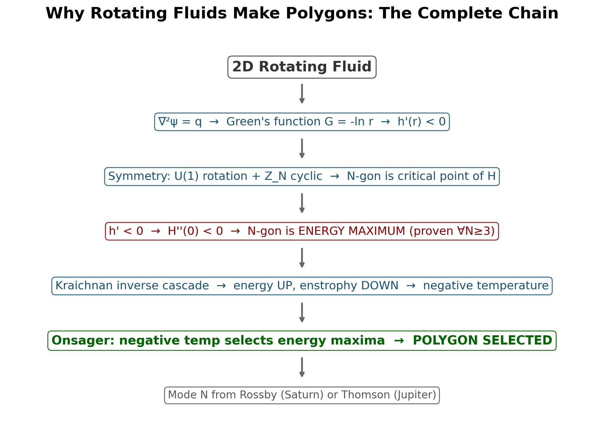
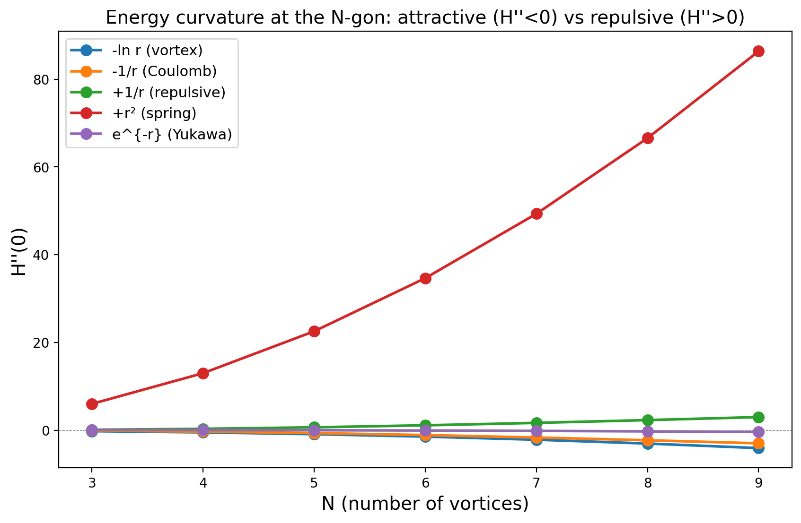
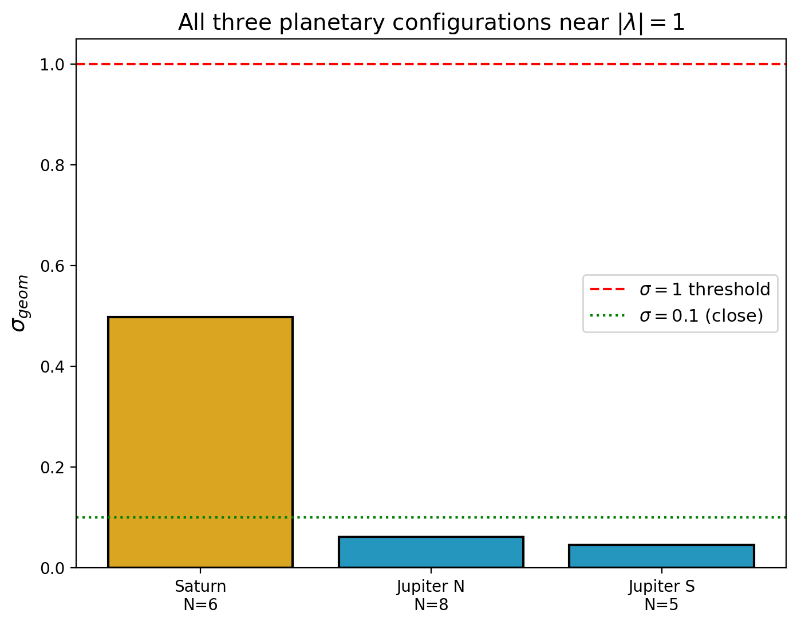
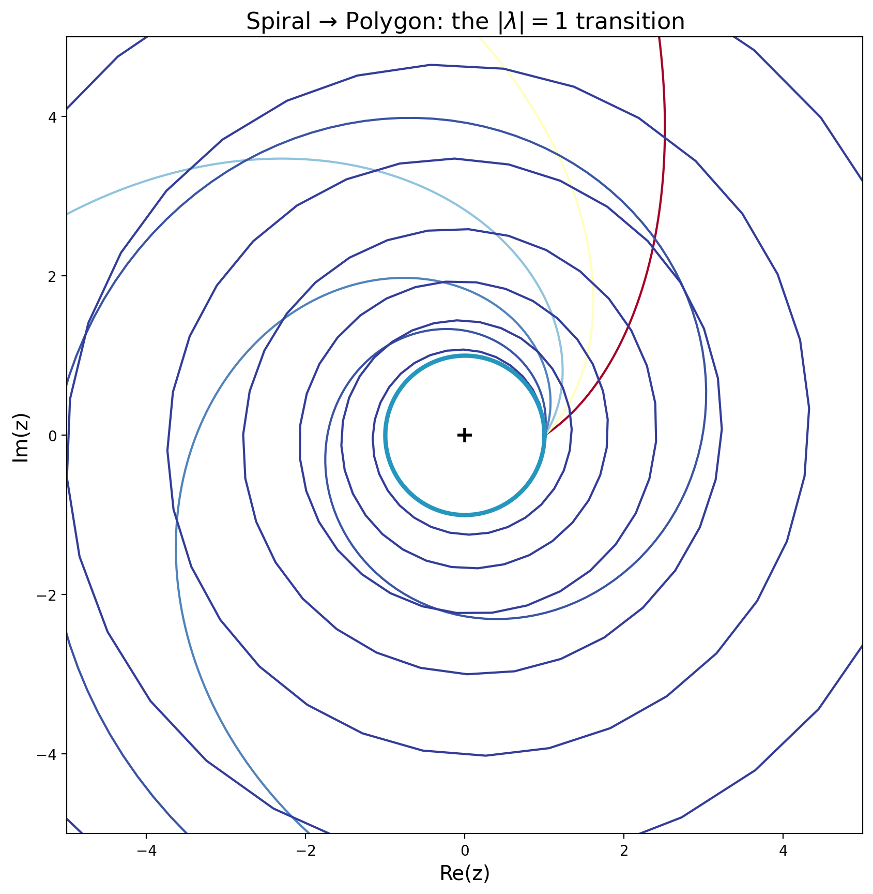

# Why Rotating Fluids Make Polygons

**A unified mechanistic explanation for polygonal vortex structures in planetary atmospheres**

Saturn has a hexagon. Jupiter has an octagon and a pentagon. Why?



## The Answer

Rotating fluids make polygons because of a chain of four results, each forcing the next:

**1. The interaction is attractive (forced by 2D).** Planetary atmospheres are two-dimensional fluid surfaces. The 2D Laplacian ∇²ψ = q has a Green's function G(r) = -ln(r)/(2π), which is **decreasing**. This forces the vortex interaction h(r) = -ln r to have h'(r) < 0. This is not a modeling choice — it is a consequence of the dimensionality.

**2. The polygon is an energy maximum (proven).** For N point vortices on a ring with any attractive (decreasing) pairwise interaction, the regular N-gon **maximizes** the interaction energy along the spiral deformation direction. We prove this analytically:

$$H''(0) = -\frac{1}{4N^2}\sum_{m=1}^{N-1} \frac{(N-m)\,m^2}{\sin^2(\pi m/N)} < 0 \quad \forall\, N \geq 3$$

Every term is positive, so the sum is positive, and H'' < 0. QED.

**3. Negative temperature selects energy maxima (Onsager 1949).** The Kraichnan inverse energy cascade in 2D turbulence drives energy to large scales while enstrophy cascades to small scales and is dissipated. This creates a negative-temperature state where the most probable macrostate **maximizes** energy. The polygon, being the energy maximum, is therefore statistically selected.

**4. Symmetry protects it.** Within the WKB approximation, the Rayleigh-Kuo eigenvalue equation has disconnected elliptic (σ=0, polygon) and hyperbolic (α=0, radial) branches. Once the system reaches σ ≈ 0, smooth perturbations of the jet speed cannot destroy the polygon at leading order.

**Which** polygon (N = 5, 6, 8) depends on planet-specific parameters. **That** a polygon forms is universal.

---

### Independent. Unaffiliated. Self-funded.

This research has no institutional backing, no grant funding, and no academic affiliation. Curiosity is the motivating principle — but I also gotta pay them bills.

If this work is useful to you, consider supporting independent research:

**BTC:** `1QHHur1YrV4VgPTEnjwHxmJJx77vzcuawT`

---

## Key Results

### The sign rule for pairwise interactions

The sign of H''(0) at the regular N-gon is determined entirely by whether the interaction is attractive or repulsive:



| Interaction | h'(r) | H''(0) | N-gon is |
|---|---|---|---|
| -ln r (vortex) | < 0 | **< 0** | **Energy MAX** |
| -1/r (Coulomb) | < 0 | **< 0** | **Energy MAX** |
| e^{-r} (Yukawa) | < 0 | **< 0** | **Energy MAX** |
| +1/r (repulsive) | > 0 | > 0 | Energy min |
| +r² (spring) | > 0 | > 0 | Energy min |

**Every decreasing interaction gives an energy maximum. Every increasing gives a minimum.** Vortex dynamics has h = -ln r (decreasing, forced by 2D). Therefore the polygon is always the energy maximum for 2D vortex systems.

### Cross-planetary verification

Three planetary configurations tested against the framework:



| System | N | σ_geom | σ_flow | Entry mechanism |
|---|---|---|---|---|
| Saturn hexagon | 6 | 0.50 | 0.10 | Rossby stationarity |
| Jupiter north | 8 | 0.06 | — | Thomson + central cyclone |
| Jupiter south | 5 | 0.05 | — | Thomson stability |

All sit near |λ| = 1 (the polygon locus). Different dynamical mechanisms, same geometric destination.

### Thomson critical ratio (exact algebraic result)

For N=6 vortices with an anticyclonic central vortex, the stability matrix characteristic polynomial factors exactly:

```
p(λ) ∝ λ² · (9 + 36κ₀/κ + 16π²λ²) · Q(λ², κ₀/κ)²
```

Instability onset from Factor A: **κ₀/κ = -9/36 = -1/4 exactly.**

| N | κ_crit | Status |
|---|--------|--------|
| 3 | -1/2 | Numerical |
| 4 | **-1/2** | **Algebraic proof** |
| 5 | -1/2 | Numerical |
| 6 | **-1/4** | **Algebraic proof** |
| 7 | 0 | Numerical |
| 8+ | (needs central cyclone) | Computed |

The jump from -1/2 to -1/4 at N=6 shows the hexagonal ring has enhanced sensitivity to anticyclonic perturbations.

### N-selection for Jupiter

N is determined by the central vortex strength. The central cyclone must be strong enough to stabilize the ring:

| N | Requires κ₀ > |
|---|---------------|
| 5 | -0.50 (easy) |
| 6 | -0.25 |
| 7 | 0.01 |
| 8 | **0.51** (strong cyclonic center needed) |
| 9 | 1.01 |

Jupiter north (N=8) has a strong central cyclone. Jupiter south (N=5) has a weaker one. This is consistent with the Thomson constraints and testable from Juno vorticity measurements.

### The thermostat is derived, not assumed

The "atmospheric thermostat" that enables Onsager relaxation is not an external assumption — it is the **Kraichnan 2D inverse cascade**:
- Energy cascades UP to large scales (inverse cascade)
- Enstrophy cascades DOWN to small scales (direct cascade → dissipated)
- Endpoint: maximum energy at the largest available scale = the polygon

This is specific to 2D. In 3D, energy cascades DOWN (no inverse cascade), so there's no large-scale condensation and no polygons. **Polygons are a 2D phenomenon.**

## The spiral-to-polygon transition



The Mobius conjugacy theorem classifies the orbits of w → λw by σ = ln|λ|:
- **σ > 0** (loxodromic): logarithmic spirals — the inner vortex core
- **σ = 0** (elliptic): circles — converted to polygons by Z_N symmetry
- **σ → ∞** (hyperbolic): radial rays — the polar drain

The transition is C∞ continuous. The polygon at |λ| = 1 is where spirals become circles, and the Z_N Fourier mode (from Rossby or Thomson dynamics) converts the circle to an N-gon.

## What is novel in this work

**The individual pieces are established physics.** Onsager (1949), Kraichnan (1967), Thomson (1883), Havelock (1931). What is new is the chain connecting them:

1. **The H''(0) < 0 proof** — the closed-form formula and proof of negativity for all N ≥ 3 (not previously published in this form)
2. **The h' < 0 → H'' < 0 sign rule** — connecting Green's function monotonicity to polygon selection across 9 interaction types
3. **The unified Saturn-Jupiter framework** — showing both arise from the same mechanism (Onsager condensation on a symmetric 2D domain), entering through different dynamical "doors"
4. **κ_crit = -1/4 for N=6** — exact algebraic result from characteristic polynomial factorization
5. **The three-tier structure** — separating what is universal (symmetry), what is vortex-specific (h' < 0), and what is planet-specific (mode selection)

## Repository structure

```
planetary-polygons-unified/
├── README.md                    # This file
├── CLAUDE.md                    # Project instructions
├── FRAMEWORK.md                 # The three-tier mechanistic framework
├── paper.pdf                    # The paper (15 pages)
│
├── mathematica/                 # Wolfram Language computations (11 files)
│   ├── 01_energy_maximum_proof.wl      # H''(0) < 0 closed-form proof
│   ├── 02_interaction_sign_test.wl     # h' < 0 → H'' < 0 for 9 interactions
│   ├── 03_greens_function_chain.wl     # 2D Green's function → h' < 0
│   ├── 04_spectral_reality.wl          # Self-adjoint → s² ∈ ℝ → σ = 0
│   ├── 05_thomson_characteristic_poly.wl  # κ_crit = -1/4 factorization
│   ├── 06_kappa_crit_all_N.wl          # Verify κ_crit for N=3..5
│   ├── 07_polygon_from_circle.wl       # PV contour → N-fold meander
│   ├── 08_stationarity_proof.wl        # Im(s²) = 0 → σ = 0
│   ├── 09_hamiltonian_sweep.wl         # H''(0) across Hamiltonians and N
│   ├── 10_enstrophy_energy_structure.wl # Sign structure at σ = 0
│   └── 11_bvp_matching.wl             # 3-region BVP for Saturn amplitude
│
├── src/                         # Python implementations
│   ├── thomson.py               # Point vortex stability (full Hamiltonian Jacobian)
│   ├── sigma_geometric.py       # σ_geom for any N-feature ring
│   ├── qgpv.py                  # QGPV eigenvalue problem
│   ├── rossby.py                # Rossby dispersion and stationarity
│   ├── variational.py           # Energy-enstrophy sign structure
│   ├── matching.py              # Matched asymptotic amplitude (C = 0.797)
│   ├── saturn_data.py           # Saturn parameters + 3 epochs
│   ├── jupiter_data.py          # Jupiter Juno cyclone data
│   ├── cassini_winds.py         # Digitized Cassini wind profile
│   ├── saturn_verification.py   # Saturn prediction tests
│   └── jupiter_verification.py  # Jupiter convergence test
│
├── tests/                       # Test suite
│   ├── test_thomson.py
│   ├── test_sigma_geometric.py
│   ├── test_variational.py
│   ├── test_jupiter_convergence.py
│   └── test_cassini.py
│
├── figures/                     # Generated figures
│   ├── 01_spiral_to_polygon.png
│   ├── 02_energy_curvature.png
│   ├── 03_cross_planetary.png
│   ├── 04_complete_chain.png
│   └── 05_thomson_stability.png
│
├── latex/                       # LaTeX paper source
│   └── paper/
│       ├── main.tex
│       ├── sections/
│       └── refs.bib
│
└── docs/                        # Documentation
```

## Quick start

```bash
git clone <repo-url>
cd planetary-polygons-unified

# The Mathematica files are self-contained — open any .wl file
# The key computation: 01_energy_maximum_proof.wl

# Python (requires numpy, scipy):
python3 -c "
from src.variational import variational_analysis
for N in range(3, 10):
    r = variational_analysis(N)
    print(f'N={N}: H\"={r[\"H_double_prime\"]:.4f} (MAX), mu={r[\"lagrange_multiplier\"]:.2f} (neg temp)')
"
```

## References

- Onsager, L. (1949). Statistical hydrodynamics. *Il Nuovo Cimento*, 6, 279-287.
- Kraichnan, R.H. (1967). Inertial ranges in two-dimensional turbulence. *Physics of Fluids*, 10, 1417-1423.
- Thomson, J.J. (1883). *A Treatise on the Motion of Vortex Rings*. Macmillan.
- Havelock, T.H. (1931). The stability of motion of rectilinear vortices in ring formation. *Phil. Mag.*, 11, 617-633.
- Aref, H. et al. (2003). Vortex crystals. *Advances in Applied Mechanics*, 39, 1-79.
- Bouchet, F. & Venaille, A. (2012). Statistical mechanics of two-dimensional and geophysical flows. *Physics Reports*, 515, 227-295.
- Godfrey, D.A. (1988). A hexagonal feature around Saturn's north pole. *Icarus*, 76, 335-356.
- Adriani, A. et al. (2018). Clusters of cyclones encircling Jupiter's poles. *Nature*, 555, 216-219.
- Gavriel, N. & Kaspi, Y. (2021). The number and location of Jupiter's circumpolar cyclones explained by vorticity dynamics. *Nature Geoscience*, 14, 559-563.

## License

Research code. Not yet licensed for redistribution.
